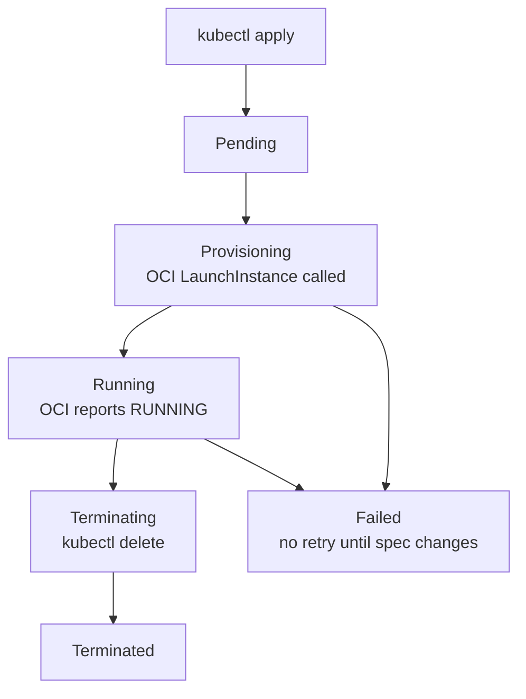
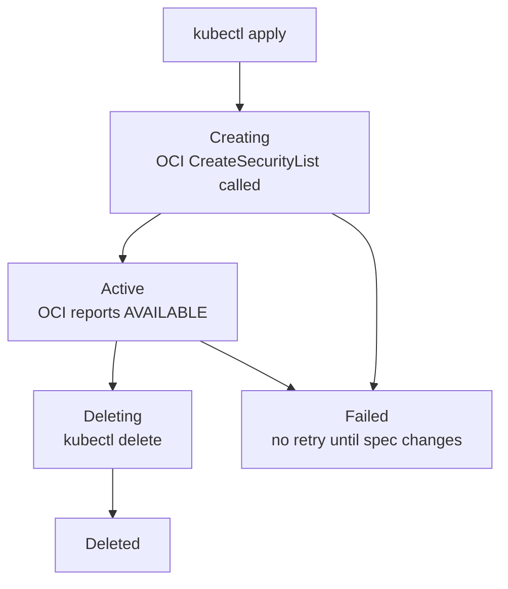

# OCI Compute Operator

A production-grade Kubernetes operator written in Go that manages the lifecycle of Oracle Cloud Infrastructure (OCI) compute instances and security policies as Kubernetes custom resources.

Built to demonstrate cloud-native platform engineering patterns relevant to large-scale AI infrastructure — including the operator pattern, CRD design, OCI API integration, Prometheus observability, and comprehensive testing with mock injection.

---

## Overview

This operator bridges Kubernetes and Oracle Cloud Infrastructure, allowing platform teams to manage OCI resources declaratively using standard Kubernetes tooling (`kubectl`, GitOps, etc.).

```bash
kubectl apply -f my-instance.yaml   # provisions a real OCI compute instance
kubectl delete ociinstance my-vm    # terminates it safely via finalizer
kubectl get ociinstances            # shows live status from OCI
```

### Custom Resources

**`OCIInstance`** — manages OCI compute instance lifecycle:
- Provisions instances via OCI Compute API
- Polls until `Running`, syncs status back to Kubernetes
- Terminates instances safely on deletion using finalizers
- Supports flex shapes with configurable OCPUs and memory
- Guards against infinite retry loops on failure

**`OCISecurityPolicy`** — manages OCI security list lifecycle:
- Creates and manages OCI VCN security lists
- Supports both ingress and egress rules with port ranges
- Full lifecycle management including safe deletion

---

## Architecture

```
┌─────────────────────────────────────────────────────────┐
│                    Kubernetes Cluster                    │
│                                                         │
│   OCIInstance CR ──► OCIInstanceReconciler              │
│   OCISecurityPolicy ──► OCISecurityPolicyReconciler     │
│                              │                          │
└──────────────────────────────┼──────────────────────────┘
                               │
                               ▼
                    ┌─────────────────────┐
                    │   OCI APIs          │
                    │  - Compute API      │
                    │  - VCN API          │
                    └─────────────────────┘
                               │
                               ▼
                    ┌─────────────────────┐
                    │   Observability     │
                    │  - Prometheus       │
                    │  - Grafana          │
                    └─────────────────────┘
```

### Key Design Decisions

**Level-triggered reconciliation** — the reconciler always compares desired state (Spec) against actual state (OCI) and drives toward convergence, regardless of what event triggered it. This makes the operator self-healing and resilient to missed events.

**Finalizer pattern** — resources carry a finalizer that prevents Kubernetes from deleting them until the corresponding OCI resource is terminated. This prevents orphaned cloud resources.

**Failed phase guard** — once a resource enters `Failed` phase, the operator stops retrying until the user changes the spec (incrementing the resource generation). This prevents infinite OCI API call loops on persistent errors.

**Dependency injection for testability** — OCI clients are defined as interfaces and injected into reconcilers, allowing tests to use mock implementations without real OCI credentials. This enables comprehensive unit testing of all reconciliation paths.

**Shared `FailableResource` interface** — both controllers implement a common interface for setting failure status, eliminating code duplication between the two reconcilers.

**Prometheus instrumentation** — every reconcile loop, OCI API call, and phase transition is measured and exposed as Prometheus metrics, enabling production observability out of the box.

---

## Project Structure

```
.
├── api/v1alpha1/
│   ├── ociinstance_types.go               # OCIInstance CRD schema and lifecycle phases
│   ├── ocisecuritypolicy_types.go         # OCISecurityPolicy CRD schema
│   └── zz_generated.deepcopy.go           # auto-generated
├── internal/controller/
│   ├── ociinstance_controller.go          # OCIInstance reconciliation loop
│   ├── ocisecuritypolicy_controller.go    # OCISecurityPolicy reconciliation loop
│   ├── metrics.go                         # Prometheus metrics registration
│   ├── oci_client.go                      # OCI client interfaces
│   ├── mock_oci_clients.go                # mock implementations for tests
│   ├── failable_resource.go               # shared interface for error handling
│   ├── ociinstance_controller_test.go          # CRD validation and finalizer tests
│   ├── ocisecuritypolicy_controller_test.go    # security policy validation tests
│   ├── ociinstance_controller_oci_test.go      # OCI lifecycle mock tests
│   └── ocisecuritypolicy_controller_oci_test.go # security policy mock tests
├── monitoring/
│   ├── docker-compose.yml                 # Prometheus + Grafana local stack
│   ├── prometheus.yml                     # Prometheus scrape config
│   └── grafana/
│       ├── provisioning/                  # auto-provisioned datasource
│       └── dashboards/                    # pre-built OCI operator dashboard
├── config/crd/bases/                      # generated CRD YAML manifests
└── config/rbac/                           # generated RBAC manifests
```

---

## Getting Started

### Prerequisites

- Go 1.21+
- Docker Desktop
- kubectl v1.25+
- kind (for local development)
- OCI account with API key configured at `~/.oci/config`
- Kubebuilder v4+

### Local Development Setup

**1. Create a local Kubernetes cluster:**
```bash
kind create cluster --name oci-operator-dev
```

**2. Install CRDs:**
```bash
make install
```

**3. Run the operator locally:**
```bash
make run
```

**4. Apply a sample OCIInstance:**
```yaml
apiVersion: compute.nvcne-demo.io/v1alpha1
kind: OCIInstance
metadata:
  name: my-instance
  namespace: default
spec:
  compartmentId: "ocid1.compartment.oc1..<your-compartment-id>"
  displayName: "my-instance"
  shape: "VM.Standard.E2.1.Micro"
  imageId: "ocid1.image.oc1..<your-image-id>"
  availabilityDomain: "bAuY:US-SANJOSE-1-AD-1"
  subnetId: "ocid1.subnet.oc1..<your-subnet-id>"
  freeformTags:
    env: "dev"
    team: "platform"
```

```bash
kubectl apply -f my-instance.yaml
kubectl get ociinstances --watch
```

**5. Apply a sample OCISecurityPolicy:**
```yaml
apiVersion: compute.nvcne-demo.io/v1alpha1
kind: OCISecurityPolicy
metadata:
  name: my-security-policy
  namespace: default
spec:
  compartmentId: "ocid1.compartment.oc1..<your-compartment-id>"
  vcnId: "ocid1.vcn.oc1..<your-vcn-id>"
  displayName: "my-security-policy"
  rules:
    - direction: "INGRESS"
      protocol: "6"
      source: "0.0.0.0/0"
      minPort: 443
      maxPort: 443
      description: "Allow HTTPS inbound"
    - direction: "EGRESS"
      protocol: "all"
      destination: "0.0.0.0/0"
      description: "Allow all outbound"
```

```bash
kubectl apply -f my-security-policy.yaml
kubectl get ocisecuritypolicies --watch
```

---

## Observability

The operator exposes Prometheus metrics on `/metrics` and includes a pre-built Grafana dashboard for production observability.

### Metrics

| Metric | Type | Labels | Description |
|--------|------|--------|-------------|
| `oci_operator_reconcile_total` | Counter | `controller`, `result` | Total reconcile loops by outcome (success/error) |
| `oci_operator_oci_api_call_duration_seconds` | Histogram | `controller`, `operation`, `result` | OCI API call latency (p50/p95) |
| `oci_operator_phase_transitions_total` | Counter | `controller`, `phase` | Lifecycle phase transition counts |

### Local Monitoring Stack

Run the operator with metrics exposed:
```bash
go run ./cmd/main.go --metrics-bind-address=:8080 --metrics-secure=false
```

Start Prometheus and Grafana:
```bash
cd monitoring
docker-compose up
```

- **Prometheus:** http://localhost:9090 — verify `oci-compute-operator` target is `UP`
- **Grafana:** http://localhost:3000 (admin/admin) — open the **OCI Compute Operator** dashboard

### Dashboard Panels

- **Reconciliation Rate** — ops/sec by controller (ociinstance, ocisecuritypolicy)
- **Reconciliation Error Rate** — error rate for alerting
- **OCI API Call Duration** — p50/p95 latency per operation (launch, get, terminate, create_security_list)
- **OCI API Call Rate** — throughput by operation and result
- **Phase Transitions** — lifecycle state change rate

---

## Testing

```bash
# Run all tests with coverage
make test

# Run linter
make lint

# Run E2E tests (creates a real kind cluster)
make test-e2e

# View coverage report
go tool cover -html=cover.out -o coverage.html
open coverage.html
```

Test coverage: **71%**

### Test Approach

- **CRD validation tests** — verify Kubernetes rejects invalid resources (empty required fields, strings >255 chars, invalid enum values, port ranges out of bounds)
- **Finalizer and idempotency tests** — verify finalizers are added exactly once and reconciliation is idempotent
- **Mock-based OCI tests** — inject fake OCI clients to test all reconciliation paths without real cloud credentials, including provisioning, status syncing, lifecycle state transitions, and deletion
- **E2E tests** — deploy the real operator to a kind cluster and verify full reconciliation lifecycle including creation and deletion of both custom resource types

---

## CI/CD

Four GitHub Actions workflows run on every push and pull request:

| Workflow | Description |
|----------|-------------|
| **Tests** | Unit tests with coverage |
| **Lint** | golangci-lint with auto-fix |
| **Docker** | Multi-platform image build and smoke test |
| **E2E Tests** | Full operator lifecycle on kind cluster |

---

## OCI Instance Lifecycle



## OCI Security Policy Lifecycle



---

## OCI Authentication

This operator uses the OCI SDK default configuration provider, which reads from `~/.oci/config`:

```ini
[DEFAULT]
user=ocid1.user.oc1..<your-user-id>
fingerprint=<your-key-fingerprint>
tenancy=ocid1.tenancy.oc1..<your-tenancy-id>
region=us-sanjose-1
key_file=~/.oci/oci_api_key.pem
```

See [OCI SDK Authentication](https://docs.oracle.com/en-us/iaas/Content/API/Concepts/sdkconfig.htm) for setup instructions.

---

## Development Notes

This project was built using **AI pair programming** with Claude as an AI pair programmer — every architectural decision understood and owned. The Prometheus/Grafana monitoring stack was added via **agentic coding** with Claude Code.

---

## Certification

OCI Generative AI Professional certification in progress.

---

## License

Copyright 2026.

Licensed under the Apache License, Version 2.0. See [LICENSE](LICENSE) for details.
